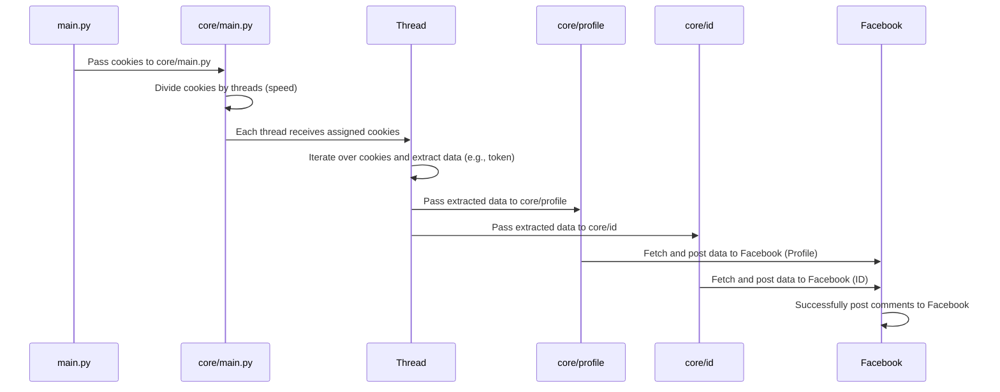

```mermaid
sequenceDiagram
    participant M as main.py
    participant C as core/main.py
    participant T as Thread
    participant P as core/profile
    participant I as core/id
    participant F as Facebook

    M->>C: Pass cookies to core/main.py
    C->>C: Divide cookies by threads (speed)
    C->>T: Each thread receives assigned cookies
    T->>T: Iterate over cookies and extract data (e.g., token)
    T->>P: Pass extracted data to core/profile
    T->>I: Pass extracted data to core/id
    P->>F: Fetch and post data to Facebook (Profile)
    I->>F: Fetch and post data to Facebook (ID)
    F->>F: Successfully post comments to Facebook
```
